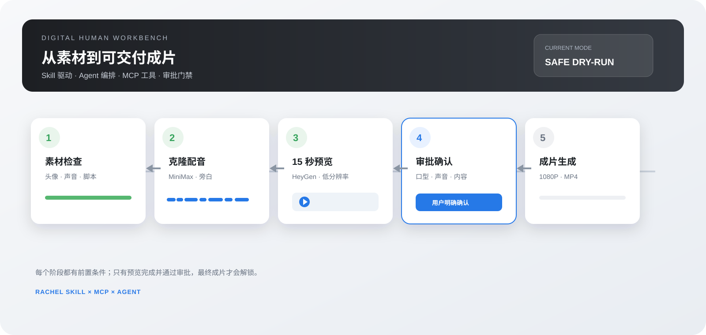

# 数字人工作台

> 项目性质：公开源码、非商业授权（source-available / noncommercial），不是 OSI 认证的 Open Source 软件。

这是基于 `rachel-digital-human-production` Skill 搭建的本地前端工作台原型。它把素材生成、素材预检、15 秒预览、审批和最终成片收进同一个项目流程。

如果你希望真正使用“开源”这个严格术语，需要接受商业使用；OSI 的定义不允许许可证按商业/非商业区分。本项目按你的要求选择非商业授权，许可证和边界见 `LICENSE`、`NOTICE.md`。

## 启动

```bash
npm install
npm run dev
npm run server
```

打开 `http://127.0.0.1:5173/`。

## 当前可用



完整架构图见 [`docs/PROJECT_OVERVIEW.md`](docs/PROJECT_OVERVIEW.md)。

- 生成中心：数字人形象、音色与旁白、脚本内容、视觉包装，生成结果会回填到素材库。
- 素材导入：头像、声音样本、Markdown/TXT 脚本。
- 项目流程：素材检查 → MiniMax 克隆配音 → 15 秒 HeyGen 预览 → 审批确认 → 1080P 成片 → 成片库。
- 模型配置中心：在“系统设置”里配置 MiniMax / HeyGen 模型、Base URL、预览/最终分辨率、密钥环境变量名和流程门禁；配置会保存在当前浏览器，不保存 API Key。
- 流程状态机：每个阶段有前置条件，未完成素材检查、旁白生成或预览审批时，不能跳到下一阶段。
- 本地状态：操作记录、队列、预览闸门和生成状态均在页面内可操作。
- Agent 接入：agent/manifest.json 注册 Rachel Skill，.mcp.json 注册 digital-human-workbench MCP；Agent 配置页可查看工具、资源和安全门禁。
- Agent 投递：Agent 配置页的“直接交给 Agent”会写入 `agent-runtime/inbox.json`；前端阶段完成、审批和成片状态会同步到同一份 `job-state.json`。
- 原始 Skill 规范和预检脚本位于 `rachel-skill/`。

后端默认是安全 dry-run。只有在用户明确确认、设置 `ALLOW_PAID_GENERATION=true`，并提供 `MINIMAX_API_KEY` / `HEYGEN_API_KEY` 后，才允许发起真实调用。实际网络调用继续遵循 `rachel-skill/SKILL.md` 的授权确认、预览审批和密钥安全规则。

## 真实调用配置

复制 `.env.example` 到后端运行环境后填写密钥；不要把 `.env` 提交到仓库。当前接口会从环境变量读取密钥，配置接口只保存环境变量名，不保存密钥值。

## 许可证与第三方边界

- 工作台新增代码：`PolyForm Noncommercial License 1.0.0`，禁止商业用途，但允许非商业使用、修改和分发，具体以 `LICENSE` 为准。
- 许可证范围和商业使用示例见 `LICENSE_SCOPE.md`；商标与修改版品牌边界见 `TRADEMARKS.md`。
- `rachel-skill/`：保留原始项目的 `MIT` 许可证，见 `rachel-skill/LICENSE`；它不受本仓库非商业许可证替换。
- `public/demo-avatar.svg`：原创抽象演示插画，不对应真实人物；生产项目必须自行确认人物、声音和素材授权。
- 依赖包的许可证由各自上游维护，发布时不应把 `node_modules/` 或构建产物提交进仓库。
- 软件许可证不替代 MiniMax、HeyGen、模型、素材、隐私和平台条款；生成内容的权利边界需要按对应提供商和素材授权另行确认。

## 发布前检查

1. 确认 GitHub 仓库设置为 Public，并检查 `git diff --cached` 中没有密钥、私有素材和运行时状态。
2. 保留 `LICENSE`、`NOTICE.md`、`rachel-skill/LICENSE` 和 `SECURITY.md`。
3. 使用 `.env.example`，不要上传 `.env`。
4. 运行 `npm run build`、`node --check server/index.mjs` 和 `python3 -m py_compile mcp/digital_human_server.py`。
5. 运行 `npm run check:release`，确认没有密钥、运行时状态或未授权演示素材。
6. 对外宣传使用“公开源码/非商业项目”，不要写“OSI 开源许可证”。
