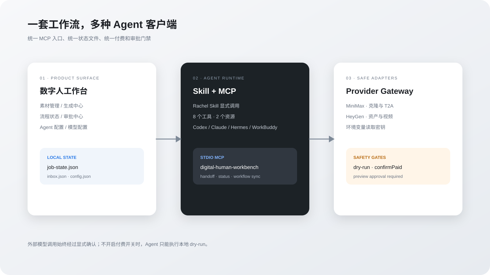

# 数字人工作台

[](https://github.com/dujiaxi2359-cloud/digital-human-workbench/actions/workflows/ci.yml)
[](./agent/clients.md)
[](./LICENSE)

一个本地优先的数字人视频生产工作台：从人物、声音和脚本，到素材检查、15 秒预览、审批和最终成片，全部收在同一个可追踪流程里。

它适合个人创作者、内容团队和 Agent 工作流使用。默认以安全 dry-run 运行；你可以先用虚拟素材完整体验流程，再按需接入 MiniMax、HeyGen 等真实服务。


## 这是什么

数字人工作台不是零散的生成按钮，而是一条有阶段门禁的生产线：

```text
准备素材 → 素材预检 → 生成旁白 → 15 秒预览 → 人工审批 → 最终成片
```


核心能力：

- **素材工作区**：导入或生成真人肖像、声音样本和脚本。
- **生成中心**：统一处理数字人形象、音色与旁白、脚本内容和视觉包装。
- **阶段门禁**：未通过素材检查或未审批预览，不能直接进入最终成片。
- **模型配置**：配置 MiniMax / HeyGen 的模型、Base URL、分辨率和环境变量名。
- **Agent + MCP**：让 Codex、Claude Desktop、Hermes、WorkBuddy 等客户端读取状态、执行预检、推进阶段和投递任务。
- **本地状态**：项目状态、操作记录、预览审批和 Agent inbox 保存在本地工作目录。

完整架构见 [`docs/PROJECT_OVERVIEW.md`](./docs/PROJECT_OVERVIEW.md)。

## 快速开始

### 运行环境

- Node.js 20 或更高版本
- Python 3.10 或更高版本（仅在使用 MCP 时需要）
- macOS、Windows 或 Linux

### 安装

```bash
git clone https://github.com/dujiaxi2359-cloud/digital-human-workbench.git
cd digital-human-workbench
npm install
```

### 启动

打开两个终端，并保持两个进程同时运行：

终端 A：启动本地 API 服务。

```bash
npm run server
```

终端 B：启动前端工作台。

```bash
npm run dev
```

然后打开：<http://127.0.0.1:5173/>。

> 如果 5173 已被占用，Vite 会提示实际端口；以终端输出的地址为准。

### 生产构建预览

```bash
npm run build
npm run preview
```

从零开始的图文步骤见 [`docs/QUICKSTART.md`](./docs/QUICKSTART.md)。

## 第一次使用

1. 打开工作台，进入一个数字人视频项目。
2. 在“生成中心”生成或在“素材库”导入真人肖像、声音样本和脚本。
3. 点击“开始检查”，确认素材路径、格式和必需内容都已通过。
4. 进入旁白阶段，选择音色并生成旁白；没有真实 API 时先使用 dry-run。
5. 生成 15 秒预览，检查人物、声音、画面和文案。
6. 确认没有问题后执行“审批确认”。审批是最终成片的前置条件。
7. 进入最终成片阶段，生成并查看输出结果。
8. 如果使用 Agent，可在 Agent 配置页把项目状态或任务投递给 MCP 客户端。

每个阶段都可以回到项目页查看状态、最近操作和下一步动作，不需要靠记忆拼接工具链。

## 真实模型配置

默认配置不会产生付费调用：

```env
ALLOW_PAID_GENERATION=false
MINIMAX_API_KEY=
HEYGEN_API_KEY=
```

需要接入真实服务时：

1. 复制环境变量模板：`cp .env.example .env`。
2. 在后端运行环境中填写 `MINIMAX_API_KEY` 和 / 或 `HEYGEN_API_KEY`。
3. 仅在已经获得用户明确确认后，将 `ALLOW_PAID_GENERATION` 改为 `true`。
4. 重启 `npm run server`，再从工作台执行对应阶段。

工作台会在后端从环境变量读取密钥；前端模型配置只保存模型路由、Base URL、分辨率和环境变量名，不保存 API Key。不要提交 `.env`，也不要把真实人物、声音或私有素材上传到公开仓库。

## Agent 与 MCP

工作台内置一个标准 MCP stdio Server，可被支持 MCP 的 Agent 客户端调用。项目根目录的 [`.mcp.json`](./.mcp.json) 已为 Codex 提供默认配置；其他客户端使用同一个 Server 即可。

启动前端和后端后，在另一个终端检查 MCP：

```bash
python3 mcp/digital_human_server.py
```

客户端配置和调用顺序见 [`agent/clients.md`](./agent/clients.md)，工具说明见 [`agent/README.md`](./agent/README.md)。

推荐的 Agent 工作顺序：

```text
读取状态 → 素材预检 → 准备旁白/预览 → 人工审批 → 同步状态 → 投递任务
```

MCP 工具默认只执行本地 dry-run 和状态操作，不会隐式发起付费请求。

## 项目结构

```text
workbench/
├── src/                    # 前端界面与工作流状态
├── server/                 # 本地 API 与真实服务适配层
├── mcp/                    # MCP stdio Server
├── rachel-skill/           # Rachel Digital Human Production Skill
├── agent/                  # Agent 清单、工具说明与客户端接入
├── docs/                   # 快速开始、架构图和流程图
├── public/generated/       # 仅用于展示的生成式项目视觉素材
└── agent-runtime/          # 本地运行状态，不应提交到仓库
```



## 常见问题

### 页面打开了，但操作没有推进

确认 `npm run server` 仍在运行，并检查前端请求是否指向 `http://127.0.0.1:3001`。

### 为什么生成按钮没有调用真实模型

这是默认安全策略。确认后端环境变量已配置，并将 `ALLOW_PAID_GENERATION=true`；真实生成还需要通过工作流的预检和审批门禁。

### Agent 找不到 MCP 工具

确认客户端使用的是工作台根目录的绝对路径，并检查 `python3 --version`。详细配置见 [`agent/clients.md`](./agent/clients.md)。

### 如何重置本地状态

停止服务后，删除本地 `agent-runtime/` 中的运行状态文件，再重新启动服务。不要删除 `rachel-skill/` 或项目源代码。

## 许可与素材边界

- 本仓库新增工作台代码采用 [PolyForm Noncommercial License 1.0.0](./LICENSE)，仅限非商业使用，具体以许可证全文为准。
- 许可证范围和示例见 [`LICENSE_SCOPE.md`](./LICENSE_SCOPE.md)；品牌边界见 [`TRADEMARKS.md`](./TRADEMARKS.md)。
- `rachel-skill/` 保留其上游 MIT 许可证，见 [`rachel-skill/LICENSE`](./rachel-skill/LICENSE)。
- `public/generated/` 和 `public/demo-avatar.svg` 仅用于界面演示，不代表真实人物或真实客户素材。
- MiniMax、HeyGen、模型、声音、肖像和第三方依赖各自适用其上游条款；使用真实素材前请先确认授权。

## 相关文档

- [`docs/QUICKSTART.md`](./docs/QUICKSTART.md)：安装、启动、第一次使用和真实模型配置
- [`docs/PROJECT_OVERVIEW.md`](./docs/PROJECT_OVERVIEW.md)：系统架构与工作流说明
- [`agent/README.md`](./agent/README.md)：MCP 工具与 Agent 工作方式
- [`agent/clients.md`](./agent/clients.md)：Codex、Claude Desktop、Hermes、WorkBuddy 接入配置
- [`SECURITY.md`](./SECURITY.md)：安全问题反馈方式
